# E-commerce System ERD

This diagram is based on the Prisma models in `prisma/schema.prisma`. Solid relationships represent declared Prisma relations (and therefore database foreign keys). Fields such as `Order.cartId` that resemble references but have no declared relation are listed below the diagram.

```mermaid
erDiagram
    User {
        string id PK
        string email UK
        string name
        string passwordHash
        string role
        datetime createdAt
    }
    Session {
        string id PK
        string userId FK
        datetime expiresAt
    }
    PasswordReset {
        string id PK
        string userId FK
        datetime expiresAt
    }
    Address {
        string id PK
        string userId FK
        string name
        string line1
        string city
        string region
        string postalCode
        string country
    }
    Collection {
        string id PK
        string slug UK
        string name
        string description
        string image
    }
    Product {
        string id PK
        string slug UK
        string collectionId FK
        string name
        string category
        int price
        int salePercent
        boolean featured
        boolean active
    }
    Image {
        string id PK
        string productId FK
        string url
        string alt
        int position
    }
    Variant {
        string id PK
        string productId FK
        string sku UK
        string color
        string colorHex
        string size
        boolean madeToOrder
    }
    Inventory {
        string id PK
        string variantId FK
        int quantity
    }
    StockMovement {
        string id PK
        string variantId FK
        int delta
        string reason
        datetime createdAt
    }
    Cart {
        string id PK
        string promotionCode
        datetime updatedAt
    }
    CartItem {
        string id PK
        string cartId FK
        string variantId FK
        int quantity
    }
    Order {
        string id PK
        string number UK
        string idempotencyKey UK
        string accessToken UK
        string cartId
        string userId FK
        string email
        string status
        int subtotal
        int discount
        int shipping
        int tax
        int total
        string promotionCode
        datetime createdAt
    }
    OrderItem {
        string id PK
        string orderId FK
        string variantId
        string name
        string variant
        string image
        int unitPrice
        int quantity
    }
    Payment {
        string id PK
        string orderId FK
        string provider
        string providerId UK
        string status
        int amount
    }
    Shipment {
        string id PK
        string orderId FK
        string carrier
        string trackingNumber
        datetime createdAt
    }
    Promotion {
        string id PK
        string code UK
        string kind
        int value
        int minimum
        datetime expiresAt
        int usageLimit
        int uses
        boolean active
    }
    Favorite {
        string id PK
        string userId FK
        string productId FK
        int savedPrice
        datetime createdAt
    }
    Review {
        string id PK
        string userId FK
        string productId FK
        string orderId FK
        int rating
        string body
        datetime createdAt
    }
    CustomerNotification {
        string id PK
        string userId FK
        string title
        string message
        string href
        datetime readAt
        datetime createdAt
    }
    AuditLog {
        string id PK
        string actorId
        string action
        string entityId
        string detail
        datetime createdAt
    }
    Newsletter {
        string id PK
        string email UK
        datetime createdAt
    }
    SupportMessage {
        string id PK
        string name
        string email
        string message
        datetime createdAt
    }
    RateLimit {
        string id PK
        int count
        datetime resetAt
    }
    UndoAction {
        string id PK
        string actorId
        string kind
        string entityId
        string before
        string after
        datetime expiresAt
        datetime usedAt
        datetime createdAt
    }

    User ||--o{ Session : has
    User ||--o{ PasswordReset : requests
    User ||--o{ Address : saves
    User o|--o{ Order : places
    User ||--o{ Favorite : saves
    User ||--o{ Review : writes
    User ||--o{ CustomerNotification : receives

    Collection ||--o{ Product : contains
    Product ||--o{ Image : has
    Product ||--o{ Variant : offers
    Product ||--o{ Favorite : favorited_in
    Product ||--o{ Review : reviewed_in
    Variant ||--o| Inventory : tracks
    Variant ||--o{ StockMovement : records
    Variant ||--o{ CartItem : selected_as
    Cart ||--o{ CartItem : contains

    Order ||--o{ OrderItem : contains
    Order ||--o| Payment : has
    Order ||--o| Shipment : has
    Order ||--o{ Review : qualifies
```

## Relationship notes

- `Order.userId` is optional, allowing guest orders. An order may have no associated user.
- `Inventory.variantId`, `Payment.orderId`, and `Shipment.orderId` are unique foreign keys, so each related record belongs to at most one variant or order.
- `Favorite` is unique by `(userId, productId)`. `Review` is also unique by `(userId, productId)`, so a user can review a product once.
- `Order.cartId` stores a cart ID without a declared Prisma relation. `OrderItem.variantId` stores a variant ID without a declared Prisma relation; order items also retain product/variant display data as snapshots.
- `Cart.promotionCode`, `Order.promotionCode`, and `CartItem` do not have a declared relationship to `Promotion`; promotion codes are stored as strings.
- `AuditLog.actorId`, `UndoAction.actorId`, and their `entityId` fields are not declared foreign keys.
- `Cart` has no declared user relation in the schema.

## Models without declared relationships

`Promotion`, `AuditLog`, `Newsletter`, `SupportMessage`, `RateLimit`, and `UndoAction` are standalone models in the current Prisma schema.
